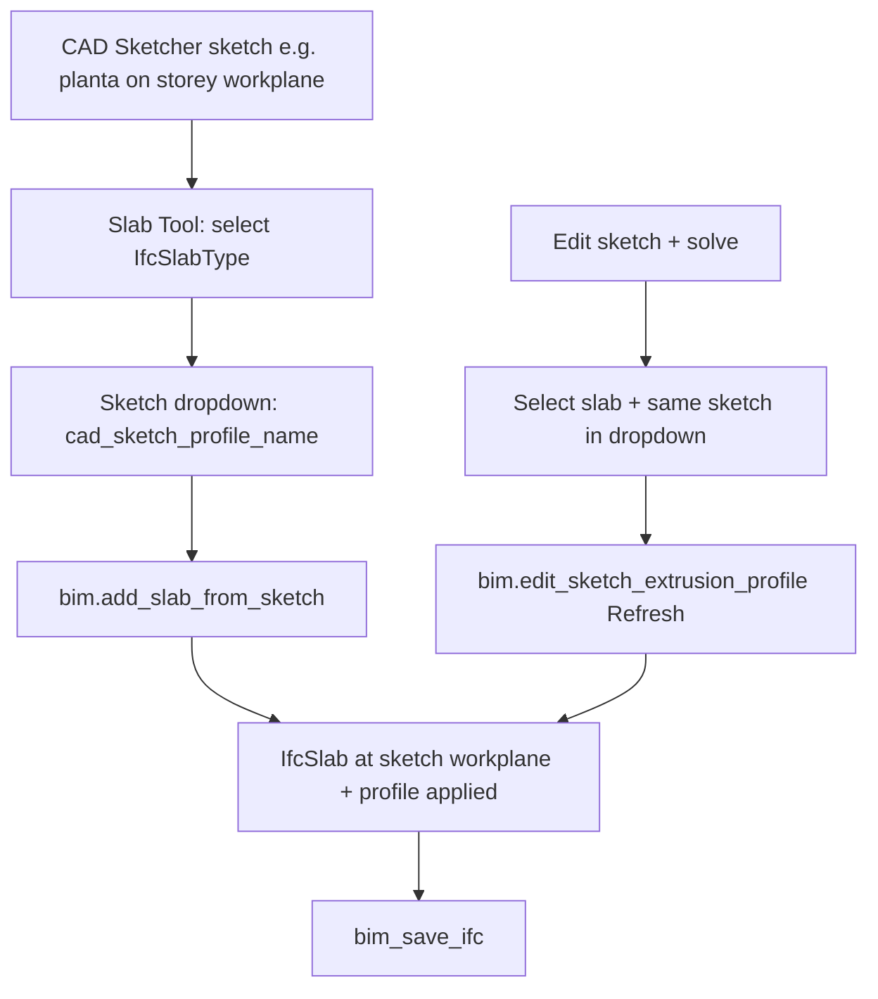

# Bonsai slab profile from CAD Sketcher (named sketch)

**Goal:** Use an existing CAD Sketcher sketch (e.g. `planta`) as the footprint for an **IfcSlab**, without manually creating a workplane point and temporary sketch entities. Re-apply the profile after sketch edits.

**Status:**

| Item | Status |
|------|--------|
| Sketch `planta` exists; construction lines excluded by `BezierConverter` | MCP verified |
| Property `cad_sketch_profile_name` + operators in IfcOpenShell `slab.py` | **Implemented in source** (2026-05-18) |
| Slab Tool UI (sketch dropdown + import) | **UI documented** — team validation pending |
| End-to-end in running Blender | **Blocked until Bonsai reload** — see [Correction context](#correction-context-awaiting-implement-command) |

**Knowledge loader topic:** `slab-sketcher` → this file (`agents/knowledge_loader.py`).

---

## Concepts

- **CAD Sketcher** — sketches are solver entities (`SlvsSketch`, `SlvsLine2D`, `SlvsArc`, …), not `bpy.data.objects`.
- **Bonsai** — slab body is `IfcExtrudedAreaSolid` + `IfcArbitraryClosedProfileDef`.
- **Named sketch workflow** — pick sketch in `BIMModelProperties.cad_sketch_profile_name`, then `bim.add_slab_from_sketch` or refresh on an existing slab.
- **Construction edges** — `entity.construction == True` is skipped by `BezierConverter` (same as legacy `bim.edit_sketch_extrusion_profile`).

---

## Bonsai API (patched IfcOpenShell)

Source: `IfcOpenShell/src/bonsai/bonsai/bim/module/model/slab.py`, `prop.py`, `workspace.py`, `misc/ui.py`.

| Symbol | Role |
|--------|------|
| `BIMModelProperties.cad_sketch_profile_name` | Enum of all `SlvsSketch` names in the scene |
| `bim.add_slab_from_sketch` | Create `IfcSlab` from active slab type + apply selected sketch profile; **keeps** scene sketch |
| `bim.edit_sketch_extrusion_profile` | Apply profile from active sketch or named sketch; preserves linked sketch when resolved by name |
| `bim.enable_editing_sketch_extrusion_profile` | Legacy: import slab profile into Sketcher or restore from `EPset_Parametric` |
| `import_cad_sketcher()` | Tries `bl_ext.user_default.CAD_Sketcher`, `CAD_Sketcher-main`, `CAD_Sketcher` |

**IFC on apply:** `EPset_Parametric` with `Engine: CADSketcher`, `Entities: <JSON>`; footprint representation updated for `IfcSlab`.

---

## Preferred workflow (named sketch)



### Prerequisites

1. **CAD Sketcher** enabled; `hasattr(bpy.context.scene, "sketcher")`.
2. **Closed profile** on non-construction edges (lines + arcs OK).
3. **Workplane Z** aligned with target **IfcBuildingStorey** (before apply).
4. **Bonsai** build includes the patch (not stock 0.8.x alone) — see correction context below.

### UI (documented, validate in viewport)

**Slab Tool** (3D View → Bonsai sidebar, `IfcSlabType` active):

1. `bim_status` / confirm IFC loaded.
2. Select relating type (e.g. `FLR200`).
3. **Sketch** → choose sketch name (e.g. `planta`).
4. Click **import** icon → `bim.add_slab_from_sketch`.
5. `bim_save_ifc`.

**Existing slab / Sandbox** (Properties → Output → Sandbox → Miscellaneous):

1. **Sketch** dropdown + **import** (new slab) or **refresh** (`edit_sketch_extrusion_profile` with `preserve_sketch` when a named sketch is set).
2. `bim_save_ifc`.

**Hotkeys (unchanged):**

- **S_A** — still starts **draw polyline slab** (`bim.draw_polyline_slab`), not sketch-based add.
- **S_E** on selected LAYER3 slab — `bim.enable_editing_extrusion_profile` (mesh profile editor, not CAD Sketcher).

---

## Save CAD Sketcher sketches with the IFC metadata file

**Problem:** Saving only the `.ifc` file does **not** include CAD Sketcher data (`scene.sketcher` entities such as `planta`). Sketches are Blender session data, not IFC entities.

**Solution:** Enable Bonsai’s **metadata blend** sidecar. On each IFC save, Bonsai writes a companion file (default name: `<project>.ifc.metadata.blend`) that keeps non-IFC session data—including CAD Sketcher sketches, constraints, and workplanes—while stripping duplicated IFC geometry from that file.

### One-time setup (Bonsai add-on preferences)

1. **Edit → Preferences → Add-ons**.
2. Search for **Bonsai** and expand the add-on.
3. Open the **Extras** section.
4. Enable **Save non ifc data to metadata blend File** (`save_metadata_blend_file`).
5. Optional: adjust **Metadata File Suffix** (default: `.ifc.metadata.blend`).

Leave this enabled for any project where you use CAD Sketcher footprints.

### Per project (before saving)

1. Open or create your IFC project in Bonsai as usual.
2. **Properties** editor → **Scene** tab → Bonsai **Current Project** panel (or use the Bonsai project menu).
3. With metadata saving enabled in preferences, a checkbox appears, e.g. **Save session data to: `myproject.ifc.metadata.blend`**.
4. Turn on **Save session data for this file** (`should_save_metadata_for_this_file`).

### Save

1. **File → Save IFC Project** (or **Ctrl+S** if mapped).
2. Confirm the status message mentions both the IFC and the metadata file, e.g.  
   `IFC Project "myproject.ifc" And Metadata File Saved to: myproject.ifc.metadata.blend`.

You should see two files next to each other:

| File | Contents |
|------|----------|
| `myproject.ifc` | BIM model (elements, geometry, standard psets) |
| `myproject.ifc.metadata.blend` | Session data: CAD Sketcher sketches, UI layout, Bonsai settings—not a full duplicate of IFC mesh |

**Note:** Saving IFC **without** the per-project checkbox (or with the preference off) still **does not** persist sketches.

### Reopen (restore sketches)

1. **File → Open IFC Project** (fresh session) **or** use **Open** from the Bonsai project menu.
2. If the IFC was saved with metadata before, Bonsai detects `IfcDocumentInformation` with scope `BLEND_METADATA` and loads `myproject.ifc.metadata.blend` automatically, then loads the IFC into that session.
3. Verify sketches: CAD Sketcher sidebar or `scene.sketcher.entities.all` should list your sketches (e.g. `planta`).

If metadata was never saved, opening only the `.ifc` starts a clean Blender session **without** your sketches.

### Checklist

- [ ] CAD Sketcher add-on enabled.
- [ ] Bonsai preference **Save non ifc data to metadata blend File** on.
- [ ] **Save session data for this file** on for this IFC.
- [ ] **Save IFC Project** (not only export from another tool).
- [ ] Sidecar file exists on disk beside the `.ifc`.
- [ ] After reopen, named sketch still appears before running slab refresh.

### What this does *not* do

- It does **not** embed full sketch constraint graphs inside the `.ifc` schema. Slab geometry in IFC remains the extruded profile; parametric link on the slab is still only `EPset_Parametric` with sketch name (see Symptom F) unless a future serializer stores more state.
- It is **not** a substitute for saving a working `.blend` if you also rely on non-Bonsai Blender data outside the metadata strip step.
- **`bim_save_ifc` via MCP** exports the IFC only; enable metadata in the UI first, then save from Blender (or ensure the same operators run with both flags set).

---

## MCP workflow

1. `bim_status`
2. `execute_blender_code` — list sketches (`sk.entities.all`, filter `SlvsSketch`)
3. Optional: run `BezierConverter` before IFC (snippet below)
4. `bim_execute_bonsai_op` with `operator_idname: bim.add_slab_from_sketch` **only if** patched Bonsai is loaded in Blender
5. `bim_save_ifc`

List sketches:

```python
import bpy
sk = bpy.context.scene.sketcher
[
    {"name": e.name, "slvs_index": e.slvs_index}
    for e in sk.entities.all
    if type(e).__name__ == "SlvsSketch"
]
```

Verify converter (non-destructive):

```python
import bpy, importlib
sk = bpy.context.scene.sketcher
sketch = next(e for e in sk.entities.all if type(e).__name__ == "SlvsSketch" and e.name == "planta")
sk.active_sketch = sketch
mod = importlib.import_module("bl_ext.user_default.CAD_Sketcher.converters")
conv = mod.BezierConverter(bpy.context.scene, sketch)
# paths are filled in EntityWalker.__init__; only call run() on older CAD Sketcher builds
if hasattr(conv, "run"):
    conv.run()
{"paths": len(conv.paths), "segments": [len(p[0]) for p in conv.paths]}
```

Add slab via MCP (after patch deployed):

```json
{
  "operator_idname": "bim.add_slab_from_sketch"
}
```

Prerequisite: `scene.BIMModelProperties.cad_sketch_profile_name` set to the sketch name (via UI or `execute_blender_code`).

Interactive MCP loop (JSON-safe):

1. Use `execute_blender_code` to reload touched Bonsai modules and return plain dict/list/string values only.
2. Use `bim_execute_bonsai_op` for UI-context-sensitive Bonsai operators. If the MCP wrapper reports `Object of type set is not JSON serializable`, the operator may still have run; immediately query the IFC/object state with `execute_blender_code`.
3. Query active object, IFC id, slab count, and `EPset_Parametric` after each attempt instead of relying on console screenshots.

---

## Legacy workflow (still valid)

Manual sequence without named selector (stock Bonsai or fallback):

1. Add occurrence (default 3×3 slab or polyline **S_A**).
2. Set **active sketch** to `planta`.
3. Select slab → `bim.edit_sketch_extrusion_profile` (temporary sketch path **deletes** sketch entities after apply unless using patched named-sketch path).

---

## Correction context (awaiting implement command)

**Do not change IfcOpenShell / Blender until the user explicitly orders implementation.** Use this section to diagnose and plan the fix.

### Symptom A — `CAD Sketcher add-on is not enabled` / `No module named 'CAD_Sketcher-main'`

**Cause:** Running **stock Bonsai** where `EditSketchExtrusionProfile` did:

```python
cad_sketcher = __import__("CAD_Sketcher-main")
```

Blender 4.x extensions install CAD Sketcher as `bl_ext.user_default.CAD_Sketcher`, not `CAD_Sketcher-main`.

**Fix (already in IfcOpenShell tree, must be deployed to Blender):**

- `import_cad_sketcher()` in `slab.py` tries, in order:
  - `bl_ext.user_default.CAD_Sketcher`
  - `CAD_Sketcher-main`
  - `CAD_Sketcher`

**Implement steps when commanded:**

1. Confirm CAD Sketcher enabled in Blender (Extensions → CAD Sketcher).
2. Install/symlink **patched** Bonsai from `IfcOpenShell/src/bonsai` (see `src/bonsai/Makefile` / project README), not only PyPI wheel.
3. Reload Bonsai add-on (disable → enable) or restart Blender.
4. Verify in Python console:

```python
import bpy, addon_utils
[name for m in addon_utils.modules() if "CAD_Sketcher" in m.__name__]
# expect bl_ext.user_default.CAD_Sketcher
hasattr(bpy.ops.bim, "add_slab_from_sketch")  # True after patch
```

5. Re-test **Sketch** dropdown + import in Slab Tool.

### Symptom B — `Select a valid CAD Sketcher sketch`

**Cause:** `cad_sketch_profile_name` empty, sketch renamed, or CAD Sketcher not loaded (`scene.sketcher` missing).

**Fix plan:** Ensure sketch exists (`SlvsSketch` in `entities.all`); set enum via UI or:

```python
bpy.context.scene.BIMModelProperties.cad_sketch_profile_name = "planta"
```

### Symptom C — `AttributeError: 'DumbSlabGenerator' object has no attribute 'container_obj'`

**Cause:** `bim.add_slab_from_sketch` is registered and running, but it calls `DumbSlabGenerator.derive_from_sketch(sketch)` directly. That bypasses the generator setup normally done by `generate()`, so `container_obj`, IFC contexts, unit scale, and slab thickness are not initialized.

**Fix plan:** In `IfcOpenShell/src/bonsai/bonsai/bim/module/model/slab.py`, move the shared setup from `generate()` into a helper such as `setup_generation_data()`, then call it from both `generate()` and `derive_from_sketch()`. Deploy/reload Bonsai after patching, then retry `bim.add_slab_from_sketch`.

### Symptom D — `module '...CAD_Sketcher' has no attribute 'convertors'. Did you mean: 'converters'?`

**Cause:** Bonsai called `import_cad_sketcher().convertors.BezierConverter` (legacy typo). Current CAD Sketcher exposes `converters.BezierConverter`.

**Fix plan:** Use `get_bezier_converter_class()` (tries `converters` then `convertors`). Deploy/reload patched Bonsai.

### Symptom E — `'BezierConverter' object has no attribute 'run'`

**Cause:** Patched Bonsai still calls `converter.run()`. Current CAD Sketcher (`EntityWalker`) walks paths in `__init__` only.

**Fix plan:** In `apply_sketch_extrusion_profile`, call `run()` only if it exists (`hasattr(converter, "run")`). Deploy/reload patched `slab.py`.

### Symptom F — `KeyError: 'bpy_struct[key]: key "sketcher" not found'`

**Cause:** Current CAD Sketcher exposes `scene.sketcher` as a Blender property group, not as `scene["sketcher"]` ID-property, and `SketcherProps` has no `to_dict()`. Storing `context.scene["sketcher"].to_dict()` in `EPset_Parametric.Entities` crashes.

**Fix plan:** Use a compatibility helper. If `scene["sketcher"].to_dict()` exists, store the full state; otherwise store a minimal JSON payload such as `{"SketchName": "planta"}`. The restore path should tolerate both full sketcher snapshots and this named-sketch fallback.

### Symptom G — `Sketch profile has no closed paths`

**Cause:** Open chain, unsolved constraints, or only construction geometry.

**Fix plan:** Solve sketch; mark guides as **Construction**; ensure profile edges form a closed loop.

### Symptom H — Slab geometry is 1000x too small or points are out of order

**Cause:** CAD Sketcher point coordinates are in Blender/SI metres. IFC profile coordinates are stored in project units. In millimetre IFC files, writing CAD Sketcher metre coordinates directly into `IfcCartesianPoint` makes the mesh 1000x too small. Also, `BezierConverter.paths` provides `(segments, directions)`; using `line.p1` ignores the ordered path direction and can scramble profile vertices.

**Fix plan:** Build points from `segment.connection_points(direction=direction)` in converter path order. Convert sketch point world coordinates into extrusion-local SI coordinates, then divide by `unit_scale` before creating `IfcCartesianPoint`.

Live verification from `planta`:

- Sketch points in Blender metres: `(-3.926705, 0.780140)` etc.
- IFC profile points in millimetres after fix: `(-3926.7048, 780.1400)` etc.
- Mesh world vertices after representation switch: `(-3.926705, 0.780140, 0.0)` etc.

### Symptom I — Slab shape/height wrong

**Cause:** Sketch workplane Z ≠ storey elevation; object placed at container Z while profile coords assume workplane.

**Fix plan:** Align sketch workplane to storey before `add_slab_from_sketch`; check `get_sketch_world_location` vs container RL.

### Symptom J — Operators missing in MCP / F3 search

**Cause:** Blender still on old Bonsai; MCP talks to live Blender process without patched add-on.

**Fix plan:** Same as Symptom A — deploy patched `bonsai` package to Blender's add-on path, reload.

---

## What does *not* work alone

| Approach | Why |
|----------|-----|
| CAD Sketcher **Convert → Mesh** | Not parametric IFC slab |
| **Draw polyline slab** (S_A) | Not tied to existing sketch |
| `get_objects_summary` for `planta` | Sketches are not objects |
| Stock Bonsai without reload | No `add_slab_from_sketch`, brittle `CAD_Sketcher-main` import |

---

## Related paths

| Path | Content |
|------|---------|
| `IfcOpenShell/src/bonsai/bonsai/bim/module/model/slab.py` | Operators, `import_cad_sketcher`, `apply_sketch_extrusion_profile` |
| `IfcOpenShell/src/bonsai/bonsai/bim/module/model/prop.py` | `cad_sketch_profile_name` |
| `IfcOpenShell/src/bonsai/bonsai/bim/module/model/workspace.py` | Slab Tool UI |
| `IfcOpenShell/src/bonsai/bonsai/bim/module/misc/ui.py` | Sandbox sketch controls |
| `blender_mcp/agents/knowledge/mcp-blender-investigation.md` | MCP inspection, addon module names |
| `blender_mcp/agents/knowledge_loader.py` | ADK topic `slab-sketcher` |

---

## Session reference

- **Sketch example:** `planta` — profile lines + arc; construction line omitted by converter.
- **No automatic sync** — after sketch edits, run refresh + `bim_save_ifc` manually.
